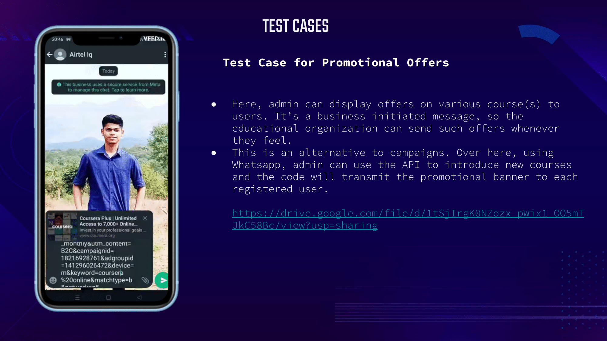
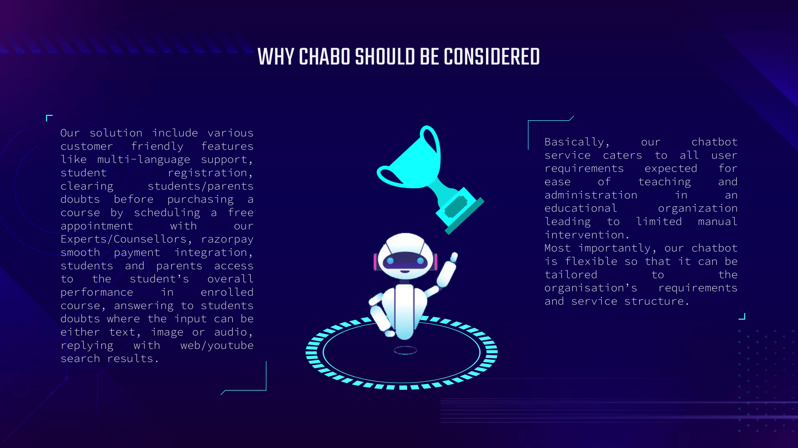
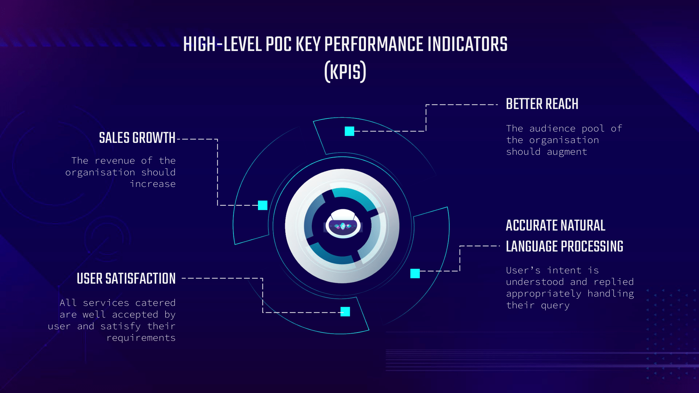
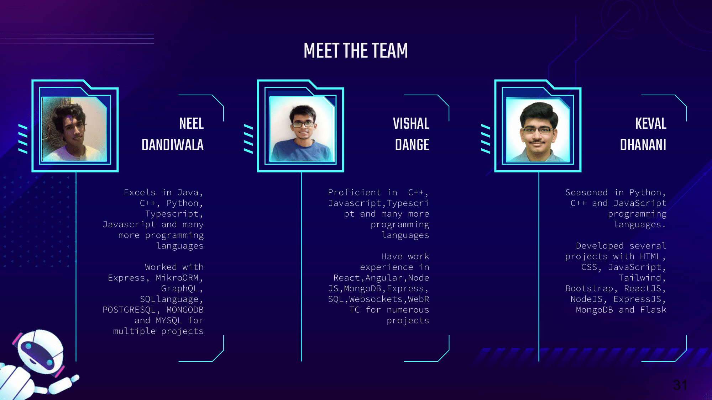

<h1 align="center"> Stranger Hacks Hackathon WhatsApp Chatbot - CHABO </h1>

> ### 🗣 This project is made for Stranger Hacks: GPT Era Hackthon organized by Devfolio

---

## Problem Statement
With the advent of ChatGPT, chatbots are great tools to facilitate student’s learning process by resolving their queries 24/7 with multilingual support. Furthermore, they provide personalisation by recommending course content according to one’s progress, engagement, magnitude of interest. Not just that, but they also assist client organisation by augmenting their audience pool.

We aim to create chatbots that subsidise the students’ pain-points as well as expand the student’s knowledge.

Before the advent of technology, students were unable to gain knowledge and key solutions at the moments of doubt. Hence, urging students to leverage this advanced benefits is our drive. This will also aid educational organisations to maximise their reach as well as revenue, creating a win-win situation on both ends. 

Simply, tackling this problem statement will lead to massive growth for the education industry, benefit the overall organisation-student interaction, improve the online learning environment and augment business. 

---

## Our Solution
We introduce you to Chabo! We have built a chatbot which can be tailored to the organisation’s requirements and service structure. 

The chatbot is created to be flexible to the owned organisation. It handles features like registration of the user, querying the organisation’s database, employing natural language processing as required by the end user and many other features which will presented in the following slides.

With this chatbot, students can enrol themselves into programs, explore courses and services offered by the organisation, tackle quizzes, be alerted for any promotional activities and use the chatbot as a helping buddy (doubt solver) for all educational or organisational information. We have geared our chatbot to use multiple languages and respond to user regarding any query, advertisements, quizzes or other matter in their desired language only.

---

## Features of our System
* User registration
* Course catalog
* Payment
* User portal profile analysis
* **ChatGPT** Query Search
* Youtube video search service
* Web search service
* Image-to-text search service
* Multi-langauge support
* Course quizzes
* Offers and Incentives in courses
* Progress reports analysis
* Scheduling and rescheduling appointments
* Organization information

---

## Tools and Tech Stack Used
* Python Programming Language
* Flask Framework
* OpenAI ChatGPT API
* Dialogflow ES 
* MongoDB for mock database and storage
* Imgur as a Cloud Bucket for static assets
* Razorpay for Payment Purpose
* Airtel IQ CPaas Solution
* Google Programmable Search Engine
* Render to deploy the solution on cloud 
* Facebook Commerce Manager for Catalogue
* WhatsApp NUMBER provided by Airtel IQ

---

## Block Diagram of our System

---

## Flow Diagram of our System

---

## Slides

## Our Team
<table>
<tr>
<td align="center"><a href="https://github.com/Neel-Dandiwala"><kbd></kbd> <b>Neel Dandiwala</b></a> </td>

<td align="center"><a href="https://github.com/vishalbdange"><kbd></kbd> <b>Vishal Dange</b></a> </td>

<td align="center"><a href="https://github.com/OptimalLearner"><kbd></kbd> <b>Keval Dhanani</b></a> </td>
</tr>
</table>
